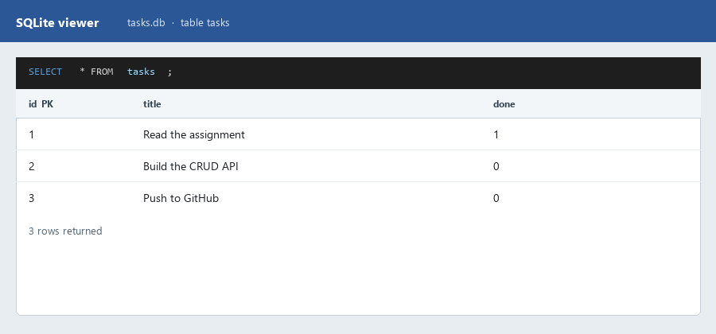
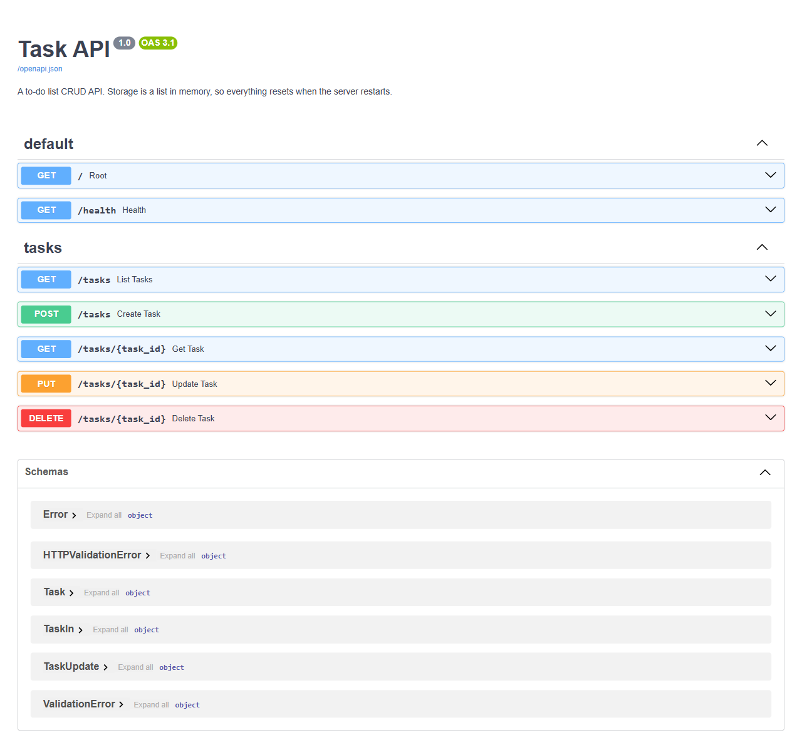

# Task API — W3/A1

A small CRUD API for a to-do list, built with **Python + FastAPI**. Tasks are
stored in **SQLite** (`tasks.db`), so they survive a server restart.

The URLs, request bodies, and responses are the same as Assignment 1.
Only the storage layer changed: `Client -> API -> SQLite` instead of
`Client -> API -> list in memory`.

## Why SQLite

SQLite is a full SQL database in a single file. There is no separate database
server to install or run. Python already includes the `sqlite3` module, so
`pip install -r requirements.txt` is enough.

That makes it a good first database: you get real SQL (`SELECT`, `INSERT`,
`UPDATE`, `DELETE`) without operating a Postgres or MySQL process. Moving to
one of those later is mostly a connection-string change — the API stays put.

## Where the database lives

| | |
| --- | --- |
| File | `tasks.db` in the project root (next to `main.py`) |
| Table | `tasks` (`id`, `title`, `done`) |
| Created | Automatically on first start (`CREATE TABLE IF NOT EXISTS`) |
| Seeded | Three example tasks, **only if the table is empty** |

`tasks.db` is gitignored. A clone creates a fresh file the first time the app
runs. Restarting does **not** re-insert the examples.

Override the path with `TASKS_DB` if you need a different file (the self-check
uses this so it never touches your real data).

## Install & run

```bash
python -m venv .venv
.venv\Scripts\activate          # Windows;  source .venv/bin/activate on macOS/Linux
pip install -r requirements.txt
uvicorn main:app --reload
```

Server: <http://localhost:8000> · Swagger UI: <http://localhost:8000/docs>

The first request (or the import of `main`) creates `tasks.db` if it is missing.

Run the self-check (exercises the whole CRUD cycle against a temporary database):

```bash
python check.py     # prints "all checks passed"
```

## Database viewer

Opened `tasks.db` and ran `SELECT * FROM tasks;`:



Example query executed:

```sql
SELECT * FROM tasks WHERE done = 1;
```

That returns only the completed row (`Read the assignment`). Other queries run
against the same file:

```sql
SELECT COUNT(*) FROM tasks;
UPDATE tasks SET done = 1;
DELETE FROM tasks WHERE done = 1;
```

Edits made in a SQLite viewer show up immediately on `GET /tasks` — the API
reads the file, it does not keep its own copy.

## Endpoints

| Method | Path              | Does                     | Success | Errors |
| ------ | ----------------- | ------------------------ | ------- | ------ |
| GET    | `/`               | What this API is         | 200     | —      |
| GET    | `/health`         | Liveness check           | 200     | —      |
| GET    | `/tasks`          | List all tasks           | 200     | —      |
| GET    | `/tasks/{id}`     | Get one task             | 200     | 404    |
| POST   | `/tasks`          | Create a task            | 201     | 400    |
| PUT    | `/tasks/{id}`     | Update title and/or done | 200     | 400, 404 |
| DELETE | `/tasks/{id}`     | Delete a task            | 204     | 404    |

Every error returns JSON in the same shape: `{"error": "Task 99 not found"}`.

### Extras (now SQL)

| Method | Path                        | Does                                     |
| ------ | --------------------------- | ---------------------------------------- |
| GET    | `/tasks?done=true`          | `WHERE done = 1`                         |
| GET    | `/tasks?search=milk`        | `WHERE title LIKE '%milk%'`              |
| GET    | `/tasks?limit=2&offset=1`   | `LIMIT` / `OFFSET`                       |
| GET    | `/stats`                    | `COUNT(*)` and `SUM(done)`               |
| POST   | `/reset`                    | Restore the three example tasks          |

Filters combine: `/tasks?done=false&search=api&limit=1`.

## Persistence experiment

Created a task, stopped the process, started it again:

```console
$ curl -s -X POST http://localhost:8000/tasks -H "Content-Type: application/json" -d '{"title":"Will I survive a restart?"}'
{"id":4,"title":"Will I survive a restart?","done":false}

# Ctrl-C, then uvicorn main:app again

$ curl -s http://localhost:8000/tasks
[{"id":1,"title":"Read the assignment","done":true},{"id":2,"title":"Build the CRUD API","done":false},{"id":3,"title":"Push to GitHub","done":false},{"id":4,"title":"Will I survive a restart?","done":false}]
```

The new task is still there. Last week it vanished with the process; now it
lives in `tasks.db`.

## Swagger UI

FastAPI still generates `/docs` from the code. Storage changing does not change
the documented API.



A bad request body still returns `400 Bad Request` (not FastAPI's default 422).
