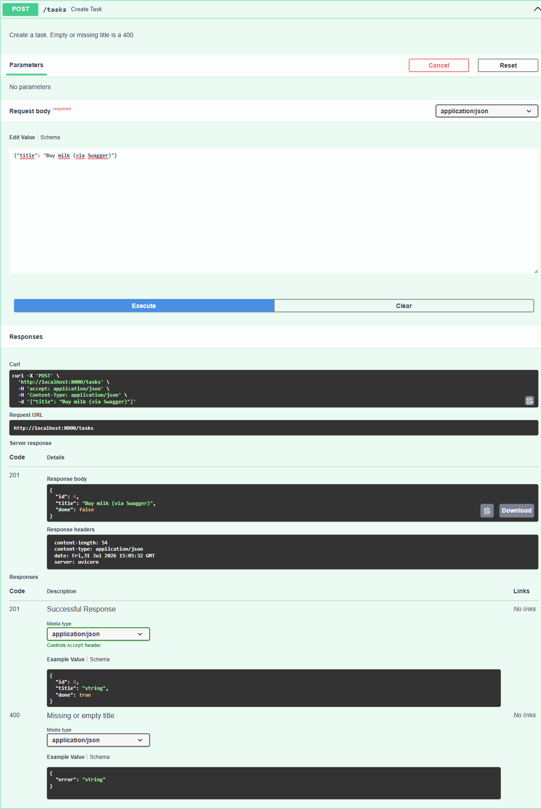

# Task API — W2/A1

A small CRUD API for a to-do list, built with **Python + FastAPI**.

Tasks are stored in a plain Python list — no database, no files. That means the
data is fast, simple, and **gone the moment the server stops**. That is on
purpose (see [The mortality experiment](#the-mortality-experiment)).

## Install & run

```bash
python -m venv .venv
.venv/Scripts/activate          # Windows;  source .venv/bin/activate on macOS/Linux
pip install -r requirements.txt
uvicorn main:app --reload
```

Server: <http://localhost:8000> · Swagger UI: <http://localhost:8000/docs>

Run the self-check (exercises the whole CRUD cycle in-process):

```bash
python check.py     # prints "all checks passed"
```

## Endpoints

| Method | Path              | Does                     | Success | Errors |
| ------ | ----------------- | ------------------------ | ------- | ------ |
| GET    | `/`               | What this API is         | 200     | —      |
| GET    | `/health`         | Liveness check           | 200     | —      |
| GET    | `/tasks`          | List all tasks           | 200     | —      |
| GET    | `/tasks/{id}`     | Get one task             | 200     | 404    |
| POST   | `/tasks`          | Create a task            | 201     | 400    |
| PUT    | `/tasks/{id}`     | Update title and/or done | 200     | 400, 404 |
| DELETE | `/tasks/{id}`     | Delete a task            | 204     | 404    |

Every error returns JSON in the same shape: `{"error": "Task 99 not found"}`.

### Extras

| Method | Path                        | Does                                     |
| ------ | --------------------------- | ---------------------------------------- |
| GET    | `/tasks?done=true`          | Only finished tasks                      |
| GET    | `/tasks?search=milk`        | Tasks whose title contains "milk"        |
| GET    | `/tasks?limit=2&offset=1`   | Pagination                               |
| GET    | `/stats`                    | `{"total": 3, "done": 1, "open": 2}`     |
| POST   | `/reset`                    | Restore the three example tasks          |

Filters combine: `/tasks?done=false&search=api&limit=1`.

**Why pagination matters:** a real API never returns "everything". A list of ten
million rows is a slow query, a huge JSON payload, and a client that has to hold
all of it in memory — for a user who will look at the first twenty. `limit` and
`offset` make the cost of a request bounded and predictable instead of growing
with the size of the database.

## curl -i transcript

Real output from a running server, one full CRUD cycle:

```console
$ curl -i http://localhost:8000/tasks
HTTP/1.1 200 OK
server: uvicorn
content-length: 150
content-type: application/json

[{"id":1,"title":"Read the assignment","done":true},{"id":2,"title":"Build the CRUD API","done":false},{"id":3,"title":"Push to GitHub","done":false}]

$ curl -i http://localhost:8000/tasks/99
HTTP/1.1 404 Not Found
server: uvicorn
content-length: 29
content-type: application/json

{"error":"Task 99 not found"}

$ curl -i -X POST http://localhost:8000/tasks -H "Content-Type: application/json" -d '{"title":"Buy milk"}'
HTTP/1.1 201 Created
server: uvicorn
content-length: 40
content-type: application/json

{"id":4,"title":"Buy milk","done":false}

$ curl -i -X POST http://localhost:8000/tasks -H "Content-Type: application/json" -d '{}'
HTTP/1.1 400 Bad Request
server: uvicorn
content-length: 33
content-type: application/json

{"error":"title: Field required"}

$ curl -i -X PUT http://localhost:8000/tasks/4 -H "Content-Type: application/json" -d '{"done":true}'
HTTP/1.1 200 OK
server: uvicorn
content-length: 39
content-type: application/json

{"id":4,"title":"Buy milk","done":true}

$ curl -i -X DELETE http://localhost:8000/tasks/4
HTTP/1.1 204 No Content
server: uvicorn

$ curl -i http://localhost:8000/stats
HTTP/1.1 200 OK
server: uvicorn
content-length: 29
content-type: application/json

{"total":3,"done":1,"open":2}
```

## Swagger UI

FastAPI generates the OpenAPI document from the code, so `/docs` is live
documentation rather than a file that drifts out of date.


"Try it out" sends real requests. The full cycle — create, list, update,
delete — was run through this page:



One deliberate deviation from FastAPI's defaults: a bad request body normally
returns `422 Unprocessable Entity`. This API answers `400 Bad Request` instead
(via an exception handler), and the generated OpenAPI document has the unused
422 entries stripped out so the docs match what the server actually does.

## The mortality experiment

Created a task, restarted the server, listed the tasks again:

```console
$ curl -s -X POST http://localhost:8000/tasks -H "Content-Type: application/json" -d '{"title":"Will I survive a restart?"}'
{"id":4,"title":"Will I survive a restart?","done":false}

# Ctrl-C, then uvicorn main:app again

$ curl -s http://localhost:8000/tasks
[{"id":1,"title":"Read the assignment","done":true},{"id":2,"title":"Build the CRUD API","done":false},{"id":3,"title":"Push to GitHub","done":false}]
```

The new task is gone. The list only ever existed in the process's memory, so
killing the process freed it along with everything else — and starting up again
just re-ran the code that builds the three example tasks from scratch. Nothing
was corrupted or lost by accident; there was simply never anywhere for the data
to persist. That is exactly the problem a database solves.
